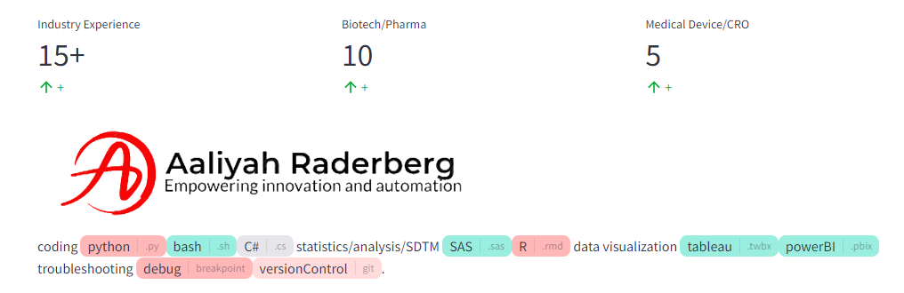
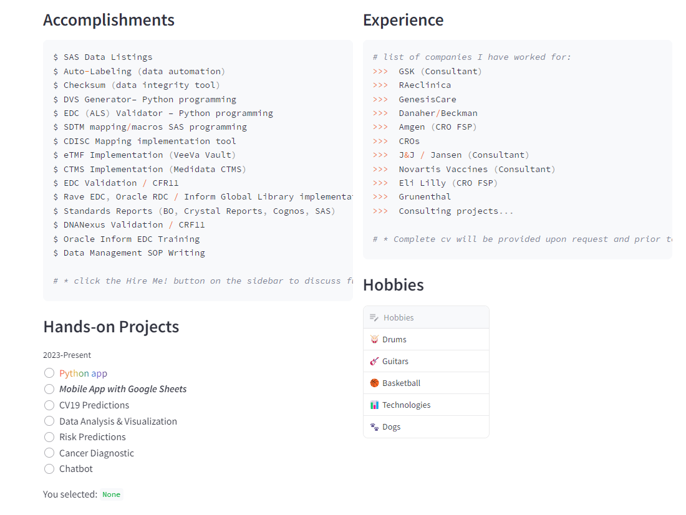
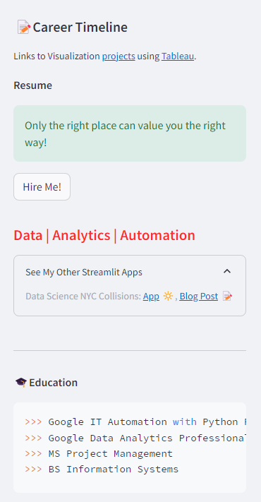

All apps created using Streamlit and Python

📝 Professional journey / Timeline CV Resume.

<H3>Requirements</H3>
* streamlit | * pandas | * pathlib | * annotated_text

<H3>Version</H3>
Python 3.12.1 | Streamlit

<H3>Deployments</H3>
https://cv-resume.streamlit.app/

<H3>Show Me</H3>

 
 

 Credit: This app was inspired by Streamlit Cheat Sheet and the SnowFlake Cheat Sheet Web App with Streamlit and Python.

